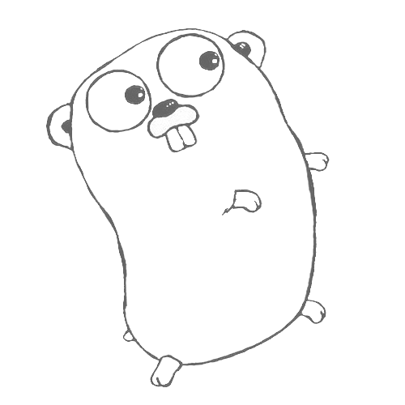
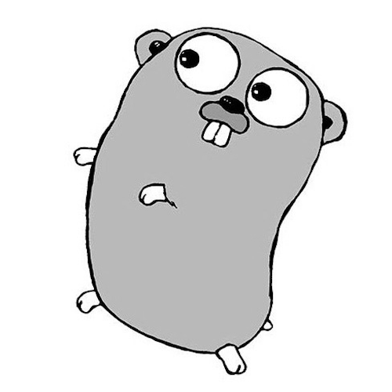

# 画像を変換してみよう

それでは、Gopherくんの画像を実際にいじっていきましょう。

## 画像を明るくする

画像明るくするためには、画像の階調値を大きくすれば良いです。そのためのPgm構造体に対するメソッドを定義すると、

```golang
func (img *Pgm) Brighten(shift int) {
	for i := 0; i < img.height; i++ {
		for j := 0; j < img.width; j++ {
			img.data[i][j] = byte(util.Min(int(img.data[i][j])+shift, img.tone))
		}
	}
}

```
という処理になります。ここでは2次元スライスで定義した画素データをループで回し、引数shiftを画素に追加して画像を明るくしています。画素データはbyte型のため、intにキャストしてからshiftを足しています。img.toneが階調の最大値のため、shiftを足した結果がimg.toneを超えないように両者の最小値を取っています。その結果をbyte型に再びキャストし、画素を上書きします。

なお、utilパッケージは以下のように定義しています。

```golang
package util

// Max returns max int value
func Max(a, b int) int {
	if a > b {
		return a
	}
	return b
}

// Min returns min int value
func Min(a, b int) int {
	if a < b {
		return a
	}
	return b
}

```

実際にこのメソッドを使用してみると、

このように明るいGopherくんが得られます。


## 左右を反転する

```golang
func (img *Pgm) Flip() {
	var fliped [][]byte

	for i := 0; i < img.height; i++ {
		fliped = append(fliped, []byte{})
		for j := 0; j < img.width; j++ {
			fliped[i] = append(fliped[i], img.data[i][img.width-j-1])
		}
	}
	img.data = fliped
}
```
左右を反転するために、一度fliped変数に左右を逆転したデータを格納してから、img.dataを上書きしています。



## 白黒反転する


白黒反転するためには、階調の最大値から現在の階調値を引けば良いです。

```golang

func (img *Pgm) Reverse() {
	for i := 0; i < img.height; i++ {
		for j := 0; j < img.width; j++ {
			img.data[i][j] = byte(img.tone - int(img.data[i][j]))
		}
	}
}
```


## 画像を拡大する

画像を拡大するために、1画素を2x2=4画素にコピーして2倍のサイズにしてみます。


```golang
func (img *Pgm) Enlarge() {
	var resized [][]byte
	var scale = 2

	for i := 0; i < img.height*scale; i++ {
		resized = append(resized, []byte{})
		for j := 0; j < img.width*scale; j++ {
			resized[i] = append(resized[i], img.data[i/scale][j/scale])
		}
	}
	img.width = img.width * scale
	img.height = img.height * scale
	img.size = img.width * img.height
	img.data = resized
}
```


以上、基本的な画像の変換処理を紹介していきました。次章ではもう少し高度な処理をしていきます。
