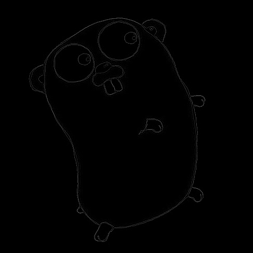
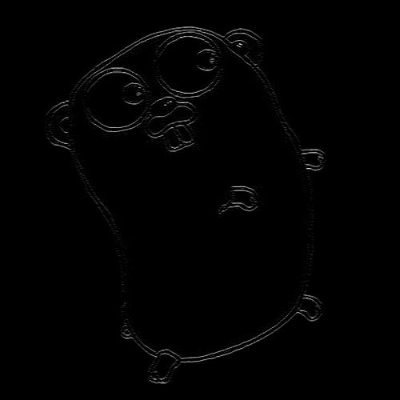

# 空間フィルタリング
## エッジ強調
注目する画素の近傍の階調値を利用して、画像にラプラシアンフィルタを適用することによって、画像のエッジを強調することができます。

```golang
func (img *Pgm) Laplacian() {
	laplacianFilter := [][]int{{1, 1, 1}, {1, -8, 1}, {1, 1, 1}}
	img.data = applyFilter(img, laplacianFilter, img.tone)
}
```
ここでlaplacianFilter変数は、注目する画素との近傍の画素の階調にかける係数を表しています。applyFilter関数のコードは以下になます。画像の周囲の行の画素に対してのフィルター処理はスキップしています。

```golang
func applyFilter(img *Pgm, filter [][]int, tone int) [][]byte {
	buf := [][]byte{}
	buf = append(buf, make([]byte, len(img.data[0])))

	// ignore periphery of image
	for i := 1; i < img.height-1; i++ {
		buf = append(buf, []byte{})
		buf[i] = append(buf[i], byte(0))
		for j := 1; j < img.width-1; j++ {
			buf[i] = append(buf[i], byte(calcFilter(img.data, i, j, filter, img.tone)))
		}
		buf[i] = append(buf[i], byte(0))
	}
	buf = append(buf, make([]byte, len(img.data[0])))
	return buf
}

func calcFilter(data [][]byte, i int, j int, filter [][]int, tone int) int {
	p := 0
	buf := []int{}

	for x := 0; x < len(filter); x++ {
		for y := 0; y < len(filter[0]); y++ {
			p += int(data[i+(x-1)][j+(y-1)]) * filter[x][y]
			buf = append(buf, int(data[i+(x-1)][j+(y-1)]))
		}
	}
	p = int(float64(p) / float64((len(filter) * len(filter[0]))))
	return util.Min(util.Max(p, 0), tone)
}

```
calcFilter関数ではフィルターの各係数を注目画素と近傍の画素にかけ、それを加算しています。そして今回はフィルターは3x3のため、加算した結果を9で割っています。計算結果は範囲が0から255の間に収まるようにして返却しています。




## パターン抽出

ここで、フィルタの値を様々に変えることでパターンを抽出することができます。例えば、水平方向のパターンを抽出するには、

```golang
func (img *Pgm) PatternHorizontal() {
	horizontalFilter := [][]int{{-1, -1, -1}, {2, 2, 2}, {-1, -1, -1}}
	img.data = applyFilter(img, horizontalFilter, img.tone)
}

```
というフィルターを使用します。



横方向の線がより強調されていることがわかります。
